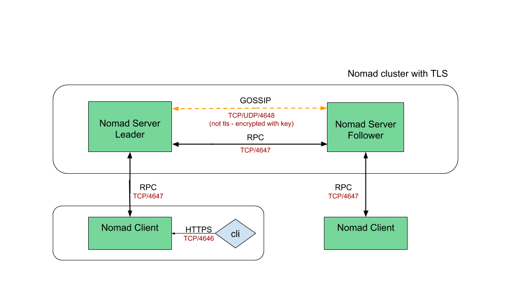

# Single region & single DC Nomad cluster with mutual TLS (mTLS) 

### High-level overview



### Pre-requisites

- vagrant
- virtualbox
- git

## How to run

#### Get the repo and bring up the environment

```
git clone https://github.com/achuchulev/nomad-vagrant-1_region-1_dc.git
cd nomad-vagrant-1_region-1_dc
vagrant up
```

#### `vagrant up` spin up 7 virtualbox vms (3 nomad servers, 3 nomad clients and 1 frontend) and execute scripts:

##### locally

```
./install/gen_self_ca.sh # check if CFSSL (Cloudflare's PKI and TLS toolkit) is installed and install it locally if missing. Use cfssl to generate local CA

```

##### frontend

```
./install/tools.sh # install required tools
./instal/cfssl.sh # install CFSSL: Cloudflare's PKI and TLS toolkit
./install/nginx.sh # install nginx server
./install/run_nginx.sh # start nginx server service
```

##### nomad server

```
./install/tools.sh # install required tools
./install/nomad.sh # install nomad
./instal/cfssl.sh # install CFSSL: Cloudflare's PKI and TLS toolkit
./install/run_nomad.sh # start nomad service
```

##### nomad client

```
./install/tools.sh # install required tools
./install/nomad.sh # install nomad
./instal/cfssl.sh # install CFSSL: Cloudflare's PKI and TLS toolkit
./install/driver.sh # install docker
./install/run_nomad.sh # start nomad service
```

#### ssh to virtualbox vm

```
vagrant ssh
```

### Access nomad

- Click [here](http://192.168.10.250) to access Nomad UI
