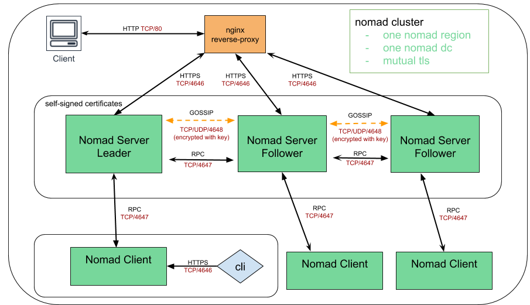

# Nomad cluster in one region & one dc nomad cluster

### High-level overview


### Pre-requisites

- vagrant
- virtualbox
- git

## How to run

##### Get the repo and bring up the environment

```
git clone https://github.com/achuchulev/nomad-vagrant-1_region-1_dc.git
cd nomad-vagrant-1_region-1_dc
vagrant up
```

##### `vagrant up` will spin up 7 virtualbox vms - 3 nomad servers, 3 nomad clients and 1 frontend

### Access nomad

#### via UI

- Click [here](http://192.168.10.250) to access Nomad UI

#### via CLI

ssh to any server or client virtualbox vm

```
vagrant ssh <box_name>
```

### Run nomad job

#### via UI

- go to [jobs](http://192.168.10.250/ui/jobs)
- click on `Run job`
- paste or author HCL or JSON to submit to your cluster. A plan will be requested before the job is submitted
- run `Plan`
- review `Job Plan` and `Run` it


#### via CLI

```
nomad job run [options] <job file>
```


